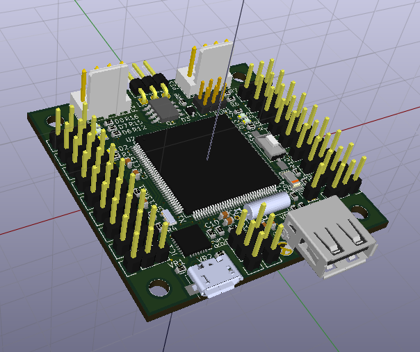

To view all 3D components of the PCB, copy the Humanoide.3dshapes folder to the folder indicates by KISYS3DMOD path.
You can find KISYS3DMOD path in Preferences->Path configuration

On Windows the path should be: C:\Program Files\KiCad\share\kicad\modules\packages3d
On GNU/Linux the path should be: /usr/share/kicad/modules/packages3d

