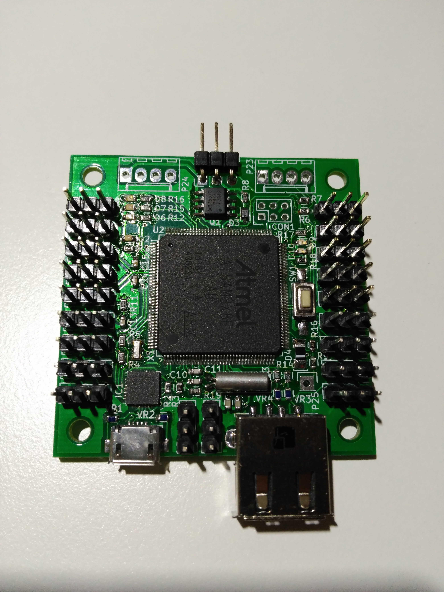
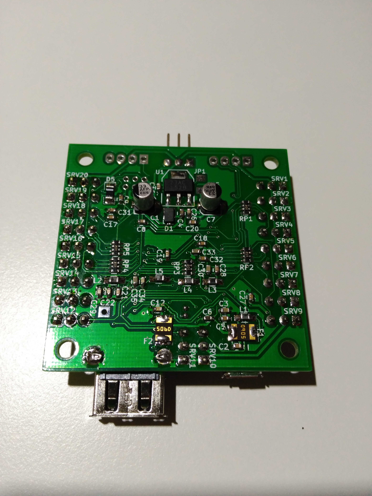

# Compact Due servo controller
This is a redesigned Arduino Due for the control of any humanoid or articulated robot, controlled by PS3 bluetooth controller, with bluetooth dongle in the native port of the SAM3 microcontroller, 20 servomotor signals, UART and I2C for bus servomotors.

## Authors
[Rubén Espino San José](https://github.com/Resaj)

[Mario Luis Álvarez Pastor](https://github.com/AxomirUxsil)

## License

Todos estos productos están liberados mediante [Creative Commons Attribution-ShareAlike 4.0 International License](http://creativecommons.org/licenses/by-sa/4.0/).  
_All these products are released under [Creative Commons Attribution-ShareAlike 4.0 International License](http://creativecommons.org/licenses/by-sa/4.0/)._
